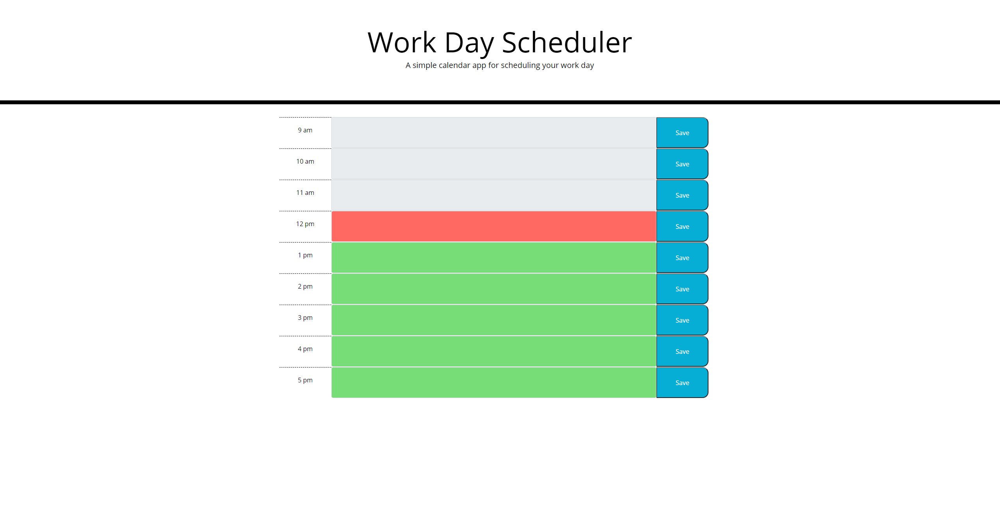
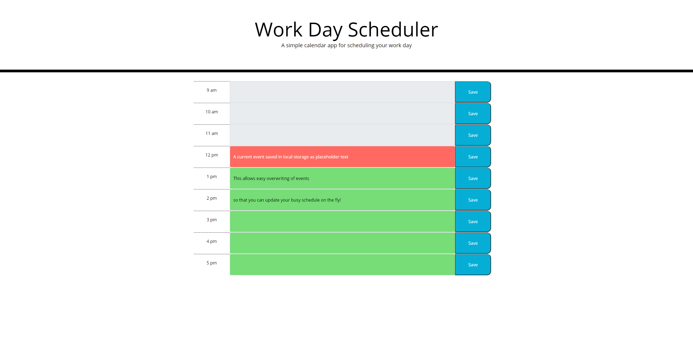

# Work Day Planner

The perfect solution to every busy working man and woman! The work day scheduler tracks the time in the day and allows you to dynamically write, update, and overwrite your events for the hour!
When you hit the save button, the entered text is saved in local storage and the input area's placeholder text is updated to show your new event whenever you refresh the page. This project utilizes large amounts of both jQuery and Bootstrap to achieve the desired functionality with a lightweight file structure.

## Technical Issues

- Page does require a manual refresh to update placeholder text and time
- The hours of the work day are not customizable

## The Finished Product

Access the finished site here: [https://v1brance.github.io/work-day-planner/](https://v1brance.github.io/work-day-planner/)

### Credits and Contributions

- Utilized jQuery library
- Utilized Bootstrap library
- Utilized moment.js library
- Utilized starter code provided in class
